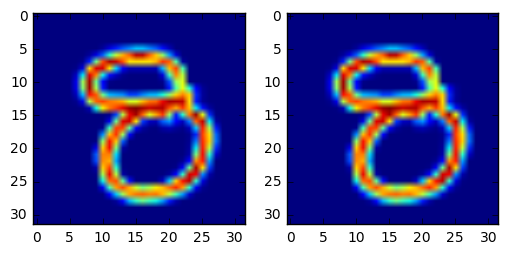

# Saak Transform 

This is a reimplementation of the paper **On Data-Driven Saak Transform** (https://arxiv.org/abs/1710.04176),  maintained by Jiali Duan and Yueru Chen.

 psnr metric: 104.294772826

psnr metric: 105.637763477

 psnr metric: 105.513759179

 psnr metric: 106.509034118

### Table of Content

- [Dataset] ( Hand-written digits classification)
	* [MNIST] ( train set: 60000, 28x28. We used the same with downloaded from http://yann.lecun.com/exdb/mnist/)

- [Installation] (sklearn and Pytorch)
	* [Sklearn Installation] Refer to http://scikit-learn.org/stable/install.html)
	* [Pytorch Installation] (Refer to http://pytorch.org)
	* [Optional: Jupyter Notebook] (Refer to http://jupyter.org/install.html)

- [How to] (Forward and Inverse Transform)
	* Forward Transform: `multi_stage_saak_trans`
	* Inverse Transform: `toy_recon(outputs,filters)`

- [To-do list]
	- [x] One-stage Saak Transform
	- [x] Multi-stage Saak Transform
	- [x] Inverse Transform

- [Other Code] 
	- [notebook] multi-stage_saak.ipynb
	- [dataset I/O] datasets.py, utils.py

- [Contact Me](#Contact-me)

## Contact me

Jiali Duan (Email: jli.duan@gmail.com)

Yueru Chen (Email: yueruche@usc.edu)
